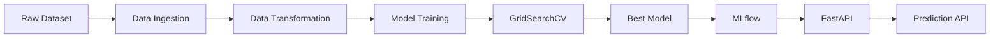
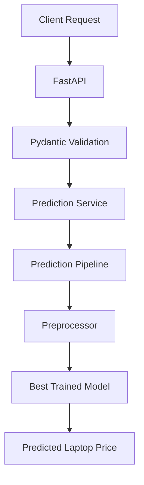

# 💻 Laptop Price Prediction API

> An end-to-end Machine Learning project for predicting laptop prices using multiple regression models, FastAPI, MLflow, Docker, and Poetry.

<p align="center">


</p>

---

# 📖 Overview

Laptop prices are influenced by multiple hardware and software specifications such as processor, RAM, storage, GPU, display configuration, operating system, and manufacturer.

This project builds an **end-to-end Machine Learning pipeline** that predicts laptop prices from these specifications while following production-oriented software engineering practices.

The project includes:

- 📊 Data preprocessing pipeline
- 🤖 Multiple regression models
- ⚙️ Hyperparameter tuning using GridSearchCV
- 🏆 Automatic best model selection
- 📈 MLflow experiment tracking
- 📦 Model Registry support
- 🚀 FastAPI REST API
- 🐳 Docker support
- 📦 Poetry dependency management
- ✅ Unit testing with Pytest
- 📝 Structured logging
- ⚠️ Custom exception handling

---

# 🎯 Why this Project?

This project demonstrates how to build a production-oriented Machine Learning application from data preprocessing to deployment.

Rather than training a single model, the project compares multiple regression algorithms, performs automated hyperparameter tuning, tracks experiments with MLflow, and exposes predictions through a FastAPI REST API. The architecture is modular, making it easy to maintain, extend, and deploy.
---

## 📑 Table of Contents

- [✨ Features](#-features)
- [🛠️ Technology Stack](#️-technology-stack)
- [🏗️ Project Architecture](#️-project-architecture)
- [⚙️ Machine Learning Pipeline](#️-machine-learning-pipeline)
- [📊 Model Performance](#-model-performance)
- [📋 Input Features](#-input-features)
- [📁 Project Structure](#-project-structure)
- [🔄 Prediction Workflow](#-prediction-workflow)
- [🚀 Installation](#-installation)
- [📖 API Documentation](#-api-documentation)
- [🌐 API Endpoints](#-api-endpoints)
- [📈 MLflow Integration](#-mlflow-integration)
- [🧪 Running Tests](#-running-tests)
- [🐳 Docker](#-docker)
- [🛣️ Future Improvements](#️-future-improvements)
- [🤝 Contributing](#-contributing)
- [📄 License](#-license)

---

# ✨ Features

- End-to-End Machine Learning Pipeline
- Data Validation & Preprocessing
- Feature Engineering
- Multiple Regression Algorithms
- Hyperparameter Tuning
- Automatic Best Model Selection
- MLflow Experiment Tracking
- MLflow Model Registry
- REST API using FastAPI
- Dockerized Deployment
- Modular Project Architecture
- Logging & Exception Handling
- Unit Testing
- Production Ready Structure

---

# ⭐ Repository Highlights

- Production-ready project structure
- Modular architecture
- FastAPI REST API
- MLflow experiment tracking
- Docker support
- Poetry dependency management
- Automated model selection
- Comprehensive documentation

---

# 📚 Key Learning Outcomes

During this project, I gained practical experience with:

- End-to-end Machine Learning pipeline development
- Data preprocessing and feature engineering
- Regression model comparison
- Hyperparameter tuning using GridSearchCV
- Experiment tracking with MLflow
- REST API development using FastAPI
- Docker containerization
- Poetry dependency management
- Modular project architecture
- Logging and exception handling

---

# 🛠️ Technology Stack

| Category | Technologies |
|----------|--------------|
| Programming Language | Python 3.12 |
| Machine Learning | Scikit-learn |
| Hyperparameter Tuning | GridSearchCV |
| API Framework | FastAPI |
| Data Validation | Pydantic |
| Experiment Tracking | MLflow |
| Dependency Management | Poetry |
| Containerization | Docker |
| Testing | Pytest |
| Logging | Python Logging |
| Version Control | Git & GitHub |

---

# 🏗️ Project Architecture



---

# ⚙️ Machine Learning Pipeline

The training pipeline performs the following steps:

1. Load the transformed training and testing datasets.
2. Initialize multiple regression algorithms.
3. Perform hyperparameter tuning using **GridSearchCV**.
4. Evaluate every model using:
   - R² Score
   - Mean Absolute Error (MAE)
   - Root Mean Squared Error (RMSE)
5. Select the model with the highest Test R² score.
6. Save the trained model.
7. Log experiments and metrics to MLflow.
8. Register the best model in the MLflow Model Registry.


---

# 📊 Model Performance

The training pipeline automatically evaluates multiple regression algorithms and selects the best-performing model based on the **highest Test R² Score**.

| Metric | Value |
|---------|-------:|
| Train R² | **0.9750** |
| Test R² | **0.9011** |
| Mean Absolute Error (MAE) | **162.26** |
| Root Mean Squared Error (RMSE) | **221.58** |

> **Note:** The project automatically compares multiple regression algorithms and saves the best-performing model.

---

# 📋 Input Features

The prediction model uses the following **22 input features**.

| Category | Features |
|----------|----------|
| Laptop | Company, Product, TypeName |
| Display | Inches, Screen, ScreenW, ScreenH, Touchscreen, IPSpanel, RetinaDisplay |
| Hardware | Ram, CPU_company, CPU_freq, CPU_model |
| Storage | PrimaryStorage, SecondaryStorage, PrimaryStorageType, SecondaryStorageType |
| Graphics | GPU_company, GPU_model |
| Operating System | OS |
| Physical | Weight |

---

# 📁 Project Structure

```text
ml-laptop-price-prediction/
│
├── app/
│   ├── routers/
│   ├── schemas/
│   ├── services/
│   └── main.py
│
├── src/
│   ├── components/
│   ├── pipeline/
│   ├── utils/
│   ├── logger.py
│   ├── exception.py
│   └── config.py
│
├── artifacts/
├── config/
├── data/
├── docs/
├── logs/
├── notebooks/
├── tests/
│
├── Dockerfile
├── docker-compose.yml
├── pyproject.toml
├── README.md
└── .gitignore
```

---

# 🔄 Prediction Workflow



---

# 🚀 Installation

## Clone the Repository

```bash
git clone https://github.com/Mayank1532/ml-laptop-price-prediction.git
cd ml-laptop-price-prediction
```

## Install Dependencies

Using Poetry:

```bash
poetry install
```

Activate the virtual environment:

```bash
poetry shell
```

---

# ▶️ Running the Application

Start the FastAPI server:

```bash
poetry run uvicorn app.main:app --reload
```

The API will be available at:

```
http://127.0.0.1:8000
```

---

# 📖 API Documentation

FastAPI automatically generates interactive API documentation.

| Documentation | URL |
|--------------|-----|
| Swagger UI | http://127.0.0.1:8000/docs |
| ReDoc | http://127.0.0.1:8000/redoc |

---

# 🌐 API Endpoints

| Method | Endpoint | Description |
|---------|----------|-------------|
| GET | `/` | API Status |
| GET | `/health` | Health Check |
| POST | `/predict/` | Predict Laptop Price |

---

# 📝 Sample Prediction Request

```json
{
  "Company": "Dell",
  "Product": "Inspiron",
  "TypeName": "Notebook",
  "Inches": 15.6,
  "Ram": 8,
  "OS": "Windows 10",
  "Weight": 2.1,
  "Screen": "Full HD",
  "ScreenW": 1920,
  "ScreenH": 1080,
  "Touchscreen": 0,
  "IPSpanel": 1,
  "RetinaDisplay": 0,
  "CPU_company": "Intel",
  "CPU_freq": 2.5,
  "CPU_model": "Core i5",
  "PrimaryStorage": 512,
  "SecondaryStorage": 0,
  "PrimaryStorageType": "SSD",
  "SecondaryStorageType": "None",
  "GPU_company": "Intel",
  "GPU_model": "HD Graphics 620"
}
```

---

# ✅ Sample Response

```json
{
  "predicted_price": 65432.18
}
```

---

# 📈 MLflow Integration

The project tracks every training run using **MLflow**.

Logged artifacts include:

- Model Name
- Train R² Score
- Test R² Score
- Mean Absolute Error (MAE)
- Root Mean Squared Error (RMSE)
- Trained Model
- Model Registry

---

# 🧪 Running Tests

Run all tests:

```bash
poetry run pytest
```

Run a specific test:

```bash
poetry run pytest tests/test_prediction_pipeline.py -v
```

---

# 🐳 Docker

Build the Docker image:

```bash
docker build -t laptop-price-prediction .
```

Run the container:

```bash
docker run -p 8000:8000 laptop-price-prediction
```

---

# 🛣️ Future Improvements

- Add XGBoost Regressor
- Add LightGBM Regressor
- Add CatBoost Regressor
- Add ExtraTrees Regressor
- Integrate SHAP Explainability
- Add CI/CD using GitHub Actions
- Increase Unit Test Coverage
- Deploy using AWS
- Add Model Monitoring
- Add Authentication & Rate Limiting

---

# 🤝 Contributing

Contributions, suggestions, and improvements are welcome.

1. Fork the repository.
2. Create a feature branch.
3. Commit your changes.
4. Open a Pull Request.

---

# 📄 License

This project is licensed under the **MIT License**.

---

# 👨‍💻 Author

**Mayank Dhillon**

If you found this project useful, consider giving it a ⭐ on GitHub.